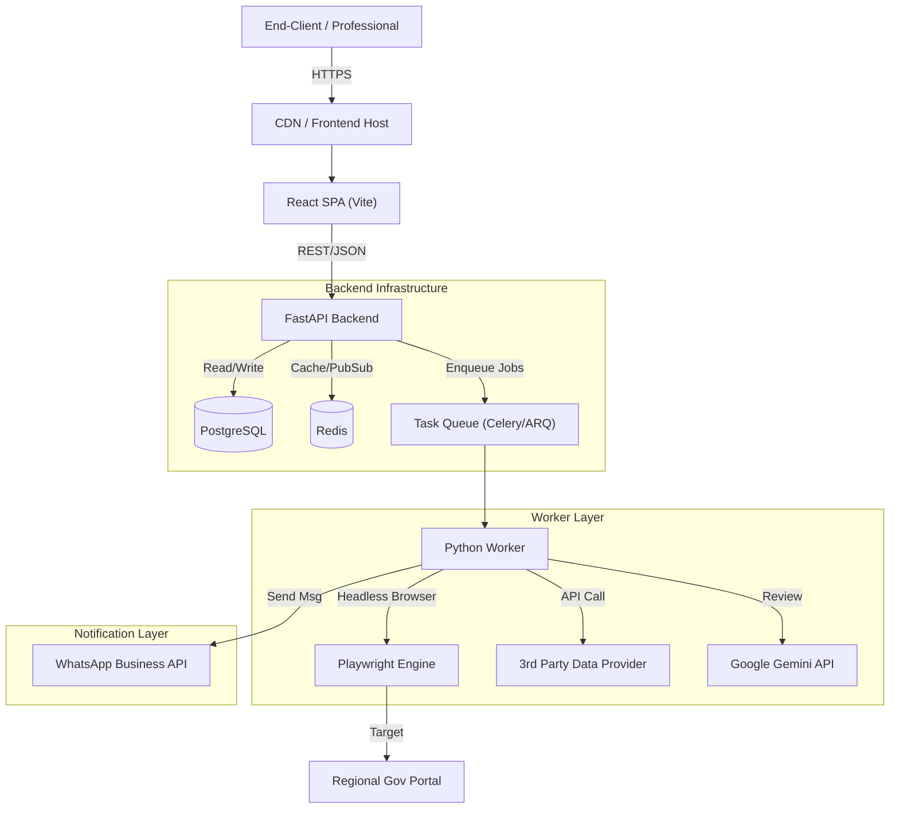

# System Architecture

## Overview
This document outlines the architecture for the Multi-Tenant SaaS Dashboard. The system is designed to handle high-concurrency data fetching (scraping/API), data aggregation, and automated multi-channel notifications (WhatsApp).

## High-Level Diagram

## Core Components

### 1. Frontend (The Dashboard)
*   **Technology**: React (Vite) + TailwindCSS.
*   **Responsibility**: 
    *   Auth UI (Login/Register).
    *   Project/Record Management Grid.
    *   Live Status Updates (via polling or WebSockets).
    *   Admin Panel for system metrics.

### 2. Backend API
*   **Technology**: Python FastAPI.
*   **Responsibility**:
    *   User Authentication (JWT).
    *   Tenant Isolation (Logical separation in DB).
    *   CRUD operations for Projects.
    *   Orchestration of "Daily Brief" jobs.

### 3. Data Ingestion Layer (The Workers)
*   **Technology**: Celery (or ARQ) + Playwright.
*   **Responsibility**:
    *   **Scraper**: Headless browsing of government portals. Needs to handle captchas, session management, and retries.
    *   **API Client**: Fetching JSON data from 3rd party providers.
    *   **Diff Engine**: Comparing new data vs. old stored data to detect "Changes".

### 4. Intelligence Layer
*   **Technology**: Google Gemini API.
*   **Responsibility**:
    *   Receiving raw text/PDF content.
    *   Generating "3-bullet summaries".
    *   Sentiment analysis (optional/future).

### 5. Notification Service
*   **Technology**: Twilio / Meta Graph API.
*   **Responsibility**:
    *   sending templated messages.
    *   Handling webhooks for message delivery status (Read/Delivered).

## Security & Data Privacy
*   **PII Handling**: All Client PII (names, phone numbers) to be encrypted at rest using Fernet (symmetric encryption).
*   **Secrets**: No hardcoding. All keys (API_KEY, DB_URL) loaded via `.env` and injected at runtime.
*   **Tenant Isolation**: Implementation of Row-Level Security (RLS) or rigorous ORM filtering to ensure Professionals only see their own clients.

## Scalability Strategy
*   **Horizontal Scaling**: The *Worker* nodes are stateless. We can spin up 10+ worker containers to handle 1,000+ simultaneous scraping requests at 6:00 AM.
*   **Rate Limiting**: Implementation of mapped delays to avoid IP bans from valid government portals.
