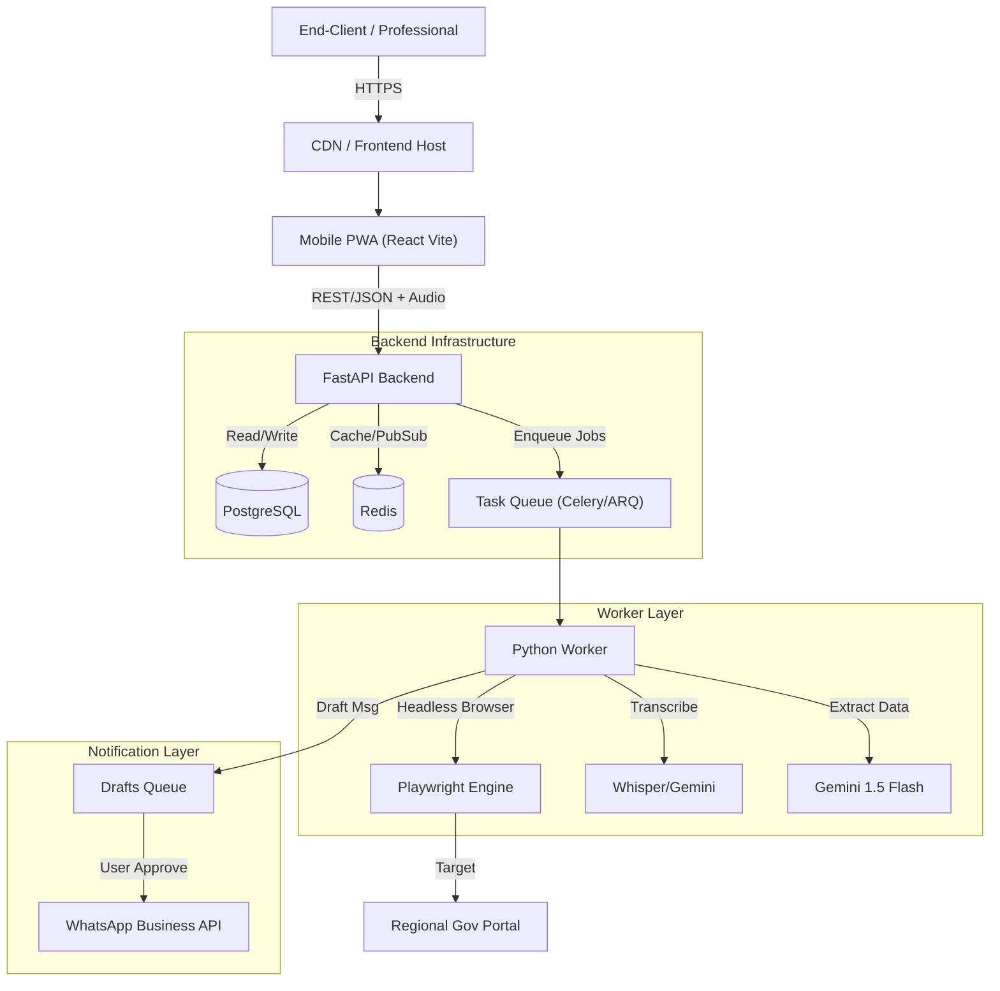

# System Architecture

## Overview
This document outlines the architecture for the Multi-Tenant SaaS Dashboard. The system is designed to handle high-concurrency data fetching (scraping/API), data aggregation, and automated multi-channel notifications (WhatsApp).

## High-Level Diagram

## Core Components

### 1. Frontend (Mobile PWA)
*   **Technology**: React (Vite) + TailwindCSS + ShadCN/UI.
*   **Responsibility**: 
    *   **Mobile-First Interface**: Bottom navigation, touch-friendly inputs.
    *   **Project Management**: CRUD Interfaces, Grid/List Views.
    *   **Admin Panel**: System metrics dashboard.
    *   **Voice Recorder**: Browser-based audio capture (`MediaRecorder` API).
    *   **Drafts Manager**: UI for reviewing and approving pending WhatsApp messages.
    *   **E-Library Search**: Fast, filtered search for documents.

### 2. Backend API
*   **Technology**: Python FastAPI.
*   **Responsibility**:
    *   **User Authentication (JWT)**: Login/Register, Tenant Isolation.
    *   **CRUD Operations**: Managing Projects, Clients, and Drafts.
    *   **Audio Upload Endpoint**: Receiver for voice notes.
    *   **Hybrid Search**: Combining SQL text search + Vector search for the e-library.

### 3. Intelligence Layer (Voice & Scraper)
*   **Technology**: Celery + Playwright + Gemini.
*   **Pipeline**:
    1.  **Voice**: Audio -> Text (STT) -> JSON (LLM).
    2.  **Scraper**: Portal Data -> Conflict Check -> Draft Generation.
    3.  **Conflict Logic**: If Portal Date > Manual Date, auto-update. Else, create "Conflict Alert".

### 4. Notification Bridge
*   **Logic**: "Human-in-the-Loop".
*   **Drafts Queue**: Intermediate state in DB. No message leaves without `status='APPROVED'`.

### 5. Notification Service
*   **Technology**: Twilio / Meta Graph API.
*   **Responsibility**:
    *   sending templated messages.
    *   Handling webhooks for message delivery status (Read/Delivered).

## Security & Data Privacy
*   **PII Handling**: All Client PII (names, phone numbers) to be encrypted at rest using Fernet (symmetric encryption).
*   **Secrets**: No hardcoding. All keys (API_KEY, DB_URL) loaded via `.env` and injected at runtime.
*   **Tenant Isolation**: Implementation of Row-Level Security (RLS) or rigorous ORM filtering to ensure Professionals only see their own clients.

## Scalability & Database Strategy
*   **Horizontal Scaling**: The *Worker* nodes are stateless. We can spin up 10+ worker containers.
*   **Database Hosting**:
    *   **Development**: Local Docker Container (`postgres:15-alpine`).
    *   **Production**: Managed Cloud Database (e.g., AWS RDS, DigitalOcean Managed Postgres) to ensure 99.9% uptime and automated backups.
    *   **Why Cloud?**: The "Daily Brief" scheduler runs at 6:00 AM. A local laptop might be off. Cloud storage ensures the system works while you sleep.
*   **Rate Limiting**: Implementation of mapped delays to avoid IP bans.

