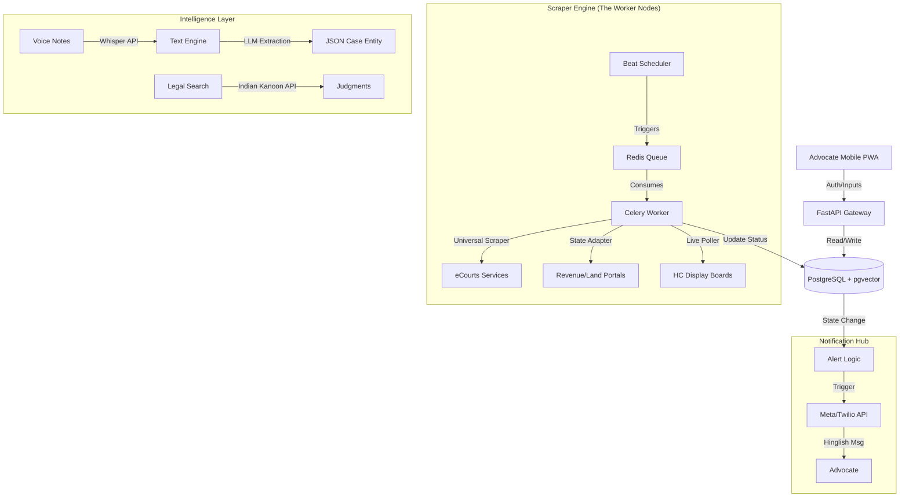

# Legal SaaS Architecture (Pan-India)

## 1. System Overview
A scalable, distributed architecture designed to handle high-concurrency scraping, real-time alerts, and AI-driven legal intelligence. The system uses a **Microservices-ready Monolith** pattern with **FastAPI** as the core coordinator and **Celery** for asynchronous heavy lifting.

---

## 2. High-Level Workflow

---

## 3. Component Details (Deep Dive)

### A. Scraper Engine (The Core)
*   **Architecture**: `AbstractScraper` class with `StateAdapter` implementations.
*   **Technology**: **Python Playwright** (Async) + **BeautifulSoup4**.
*   **Stealth & Resilience Strategy**:
    *   **Browser Fingerprinting**: Use `playwright-stealth` to mimic real user behavior (e.g., random mouse movements, real User-Agent strings).
    *   **Proxy Rotation**: Application of **Residential IPs** (India Geo-targeted) to avoid IP bans.
    *   **Captcha Solving**: 
        *   **Tier 1**: Local OCR (Tesseract) for simple captchas (Cost: ₹0).
        *   **Tier 2**: 2Captcha/Anti-Captcha API for complex challenges (Cost: ~₹0.10/solve).
    *   **Backoff Strategy**: Exponential backoff (e.g., 2s, 4s, 8s) on 503/429 errors.

### B. Live Board Poller (Real-Time)
*   **Specific Challenge**: `hcraj.nic.in` and other HCs have "Display Boards" that update every 10-30 seconds.
*   **Implementation**: Lightweight `aiohttp` poller (No Headless Browser) fetching JSON/HTML every 30s.
*   **Alert Logic**:
    *   Cache `Current_Item_No` in **Redis** (TTL: 60s).
    *   Compare with `User_Case_Item_No`.
    *   If `(User_Item - Current_Item) <= 3` -> Trigger High Priority **"Case Incoming"** Alert.

### C. Legal Intelligence (The Brain)
*   **Voice Pipeline**:
    *   **Input**: MP3/WAV/AAC from WhatsApp or App.
    *   **Process**: `OpenAI Whisper` (Model: `tiny` or `base` for speed) -> Transcribes Hinglish -> `Gemini Flash` extracts {CaseNo, NextDate, Judge}.
*   **RAG (Retrieval Augmented Generation)**:
    *   **Vector DB**: `pgvector` extension in Postgres.
    *   **Source**: **Indian Kanoon API** (External).
    *   **Flow**: User Query -> Embedding (OpenAI `text-embedding-3-small`) -> Vector Search -> Context Retrieval -> LLM Summary.

### D. Notification Hub
*   **Queue System**: Priority Queues in Celery (`high_prio` for Real-time alerts, `low_prio` for Daily Briefs).
*   **Channel**: **WhatsApp Business API** (WABA).
*   **Pricing Optimization**: 
    *   Utilize **24-hour Free Window** for user-initiated conversations.
    *   Batch "Daily Brief" and "Next Date" alerts to minimize paid template usage context.
    *   Est. Cost: **₹0.13 - ₹0.15** per Utility Message.

---

## 4. Security, Compliance & Scale

### A. Data Security & Privacy (DPDP Act 2023)
*   **Encryption**: AES-256 encryption for Case Data at rest; TLS 1.3 for data in transit.
*   **Consent**: Strict "Opt-in" flow for Advocates to track cases.
*   **Data Residency**: All data stored in **India Region (Mumbai)** servers to comply with data localization norms.

### B. Ethical Scraping Policy
*   **Robots.txt**: Scrapers must parse and respect `Allow/Disallow` directives where technically feasible.
*   **Rate Limiting**: Hard limit of **1 Request / Minute** per IP per Domain to prevent DoS.
*   **Identity**: User-Agent string will identify as `Bot/LegalTech-Research` to be transparent to admins.

### C. Infrastructure Scalability
*   **Database**: Managed PostgreSQL with Read Replicas for high-read (Dashboard) traffic.
*   **Worker Nodes**: Auto-scaling Group (ASG) for Scrapers based on Queue Depth.
*   **Monitoring**: Prometheus + Grafana for scraping success rates and error spikes.

---

## 5. Database Schema (Conceptual)

### Entities
*   **Advocate**: `id`, `name`, `phone`, `subscription_tier`, `state_licenses`.
*   **Court**: `id`, `type` (HC/District/Revenue), `state`, `adapter_code` (e.g., `RAJ_HC`).
*   **Case**: `id`, `cnr_number`, `court_id`, `petitioner`, `respondent`, `current_stage`, `next_date`.
*   **Hearing**: `id`, `case_id`, `date`, `business` (Proceeding), `judge_name`.
*   **LiveTracking**: `id`, `advocate_id`, `case_id`, `today_item_no`, `status` (Pending/Called).
